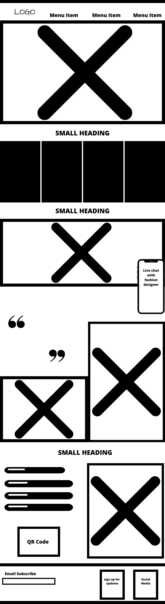
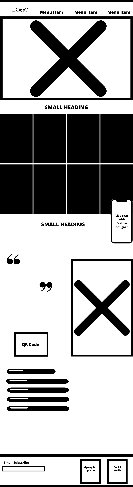
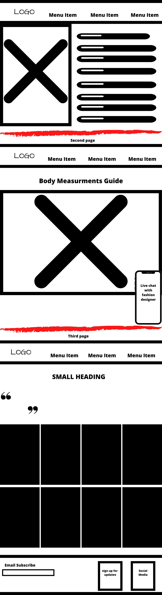
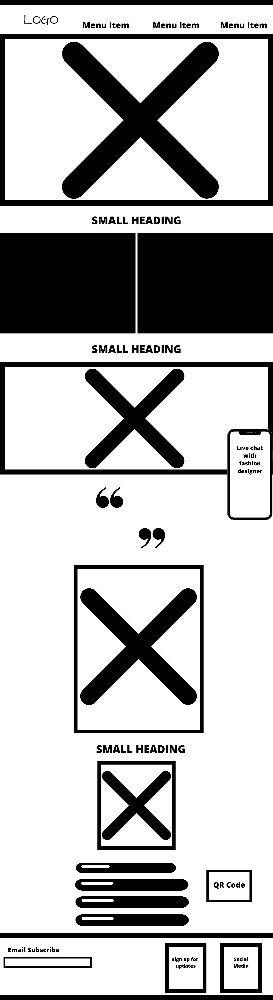
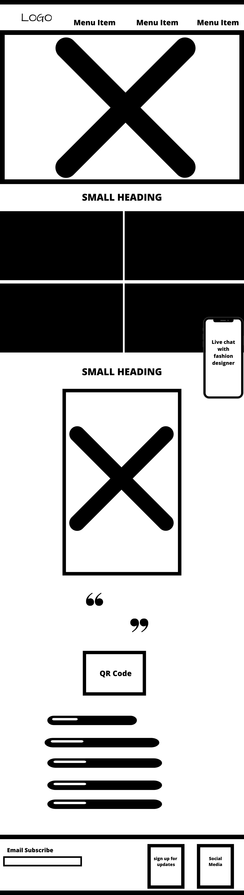
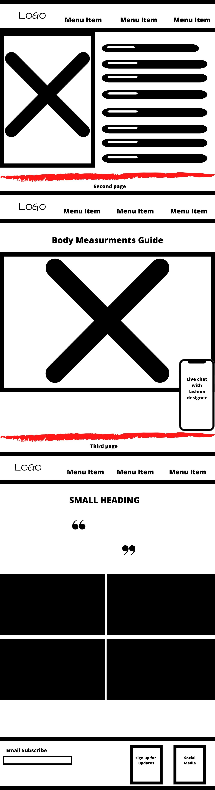

# Xevonquii
The title of this fashion website is Xevonquii.

Description:
This website is a fashion brand aimed to give users a luxury fashion design service. One the site, the user can choose their measurements and opt to live chat with a fashion designer to build a casual dress with a luxury experience. according to their specific shape. Positive affirmations and quotes are posted at random on the website to enhance the users experience . The goal of this is to make them feel so motivated, even when they exit the website. This website functions as an online fashion showroom where users can browse designs, and set up a call to have an items made by hand from the owner. The goal is to provide customers with a one of a kind designer experience.

Wireframes: 
Desktop -

Tablets and Mobile -

API: 
https://pprathameshmore.github.io/QuoteGarden/
http://goqr.me/api/

MVP: 
Minimum Goals - Add the 2 APIs and curate this website to give a luxury fashion experience online. 
Need to have features - live chat, motivational quotes, body measurement charts that are user friendly and easy to understand. 

Post-MVP: 
Nice to have features - Video chat with clients to discuss body shape and concerns. I would like to add the Easy Size function to the website. Some type of application that allows users to build their dress online and it is sent to me to be created
